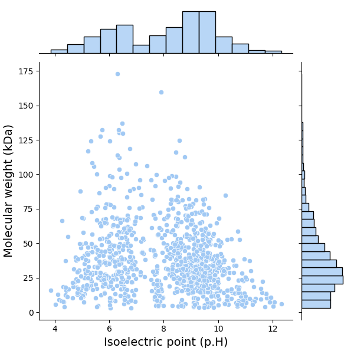
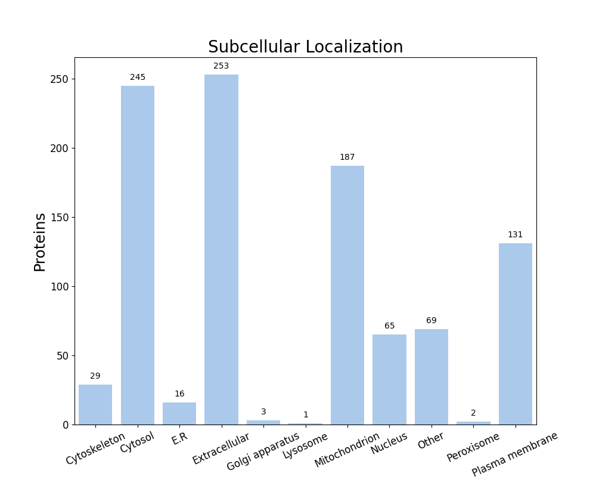

FastProtein Software 1.0
========================
##### Protein Information Software

---
### Summary
| Information                          | Value              |
| ------------------------------------ | ------------------ |
| Processed proteins                   | 1001               |
| Molecular mass (kda) mean            | 37.55 &#177; 24.91 |
| Isoelectric point mean               | 8.06 &#177; 1.80   |
| Hydrophicity mean                    | -0.04 &#177; 0.39  |
| Aromaticity mean                     | 0.08 &#177; 0.03   |
| Proteins with TM                     | 250                |
| Proteins with SP                     | 183                |
| Proteins with GPI                    | 12                 |
| Membrane proteins                    | 259                |
| Proteins with E.R Retention domains  | 149                |
| Proteins with NGlycosylation domains | 498                |
### Molecular mass (kDa) vs Isoelectric point (pH)

---
### Subcellular localization (by WolfPSort) - Organism: animal

| Subcellular localization | Proteins |
| ------------------------ | -------- |
| Extracellular            | 253      |
| Cytosol                  | 245      |
| Mitochondrion            | 187      |
| Plasma membrane          | 131      |
| Other                    | 69       |
| Nucleus                  | 65       |
| Cytoskeleton             | 29       |
| E.R                      | 16       |
| Golgi apparatus          | 3        |
| Peroxisome               | 2        |
| Lysosome                 | 1        |
---
### E.R Retention domain summary
| Domain | Quantity |
| ------ | -------- |
| RQEL   | 8        |
| KEEL   | 13       |
| ADEL   | 10       |
| AEEL   | 14       |
| AQEL   | 24       |
| REEL   | 11       |
| SDEL   | 10       |
| QEEL   | 9        |
| RDEL   | 11       |
| SEEL   | 9        |
Only top 10

---
### NGlyc domain summary
| Domain | Quantity |
| ------ | -------- |
| NAT    | 35       |
| NAS    | 61       |
| NLS    | 61       |
| NLT    | 32       |
| NIS    | 41       |
| NVS    | 57       |
| NGT    | 32       |
| NGS    | 38       |
| NTS    | 32       |
| NTT    | 34       |
Only top 10

---
| Id     | Length |  kDa  | Isoelectric_Point | Hydropathy | Aromaticity | Localization  | TMHMM_2 | Phobius_TM | PredGPI | Membrane_evidences | Membrane_evidences_detail |  SignalP5   | Phobius_SP | ER_Retention_Total | NGlyc_Total | ER_Retention_Domains |                                NGlyc_Domains                                |                          Header                          | Local_alignment_description | Gene_Ontology | Interpro_Annotation | PFAM_Annotation | Panther_Annotation |
| ------ |:------:|:-----:|:-----------------:|:----------:|:-----------:|:-------------:|:-------:|:----------:|:-------:|:------------------:|:-------------------------:|:-----------:|:----------:|:------------------:|:-----------:|:--------------------:|:---------------------------------------------------------------------------:|:--------------------------------------------------------:| --------------------------- | ------------- | ------------------- | --------------- | ------------------ |
| O83553 |  573   | 62.43 |       6.30        |   -0.06    |    0.08     |    Cytosol    |    0    |     0      |    -    |         0          |                           |      -      |     -      |         0          |      3      |                      |                    NAS[61-64];NLT[472-475];NSS[564-567]                     | Pyrophosphate--fructose 6-phosphate 1-phosphotransferase | -                           |               |                     |                 |                    |
| P29723 |  434   | 47.67 |       5.39        |   -0.34    |    0.10     | Extracellular |    0    |     0      |    -    |         0          |                           | SP(Sec/SPI) |     Y      |         0          |      0      |                      |                                                                             |           Putative DD-carboxypeptidase TP_0574           | -                           |               |                     |                 |                    |
| O30405 |  356   | 41.01 |       9.13        |   -0.36    |    0.12     |      E.R      |    1    |     0      |    -    |         1          |            TM             | SP(Sec/SPI) |     Y      |         0          |      1      |                      |                                 NMT[77-80]                                  |         Glycerophosphodiester phosphodiesterase          | -                           |               |                     |                 |                    |
| O67998 |  287   | 32.00 |       9.28        |   -0.13    |    0.11     | Mitochondrion |    1    |     1      |    -    |         2          |    PHOBIUS_TM&#124;TM     | SP(Sec/SPI) |     -      |         0          |      0      |                      |                                                                             |              Outer membrane protein TP0453               | -                           |               |                     |                 |                    |
| O83097 |  438   | 47.80 |       5.48        |    0.07    |    0.06     |    Cytosol    |    0    |     0      |    -    |         0          |                           |      -      |     -      |         0          |      4      |                      |             NDT[136-139];NQS[184-187];NLT[200-203];NET[402-405]             |              Replicative DNA helicase DnaB               | -                           |               |                     |                 |                    |
| O83107 |  340   | 37.52 |       8.97        |    0.01    |    0.06     | Extracellular |    0    |     0      |    -    |         0          |                           |      -      |     -      |         0          |      2      |                      |                          NLS[127-130];NTS[261-264]                          |   Probable dual-specificity RNA methyltransferase RlmN   | -                           |               |                     |                 |                    |
| O83159 |  618   | 68.12 |       6.20        |   -0.25    |    0.09     |    Cytosol    |    0    |     0      |    -    |         0          |                           |      -      |     -      |         0          |      2      |                      |                          NVS[553-556];NGS[605-608]                          |         Phosphoenolpyruvate carboxykinase [GTP]          | -                           |               |                     |                 |                    |
| O83258 |  657   | 72.17 |       9.09        |    0.05    |    0.09     |     Other     |    0    |     0      |    -    |         0          |                           |      -      |     -      |         1          |      0      |    AQEL[547-551]     |                                                                             |             Replication restart protein PriA             | -                           |               |                     |                 |                    |
| O83327 |  577   | 62.15 |       6.66        |    0.04    |    0.07     | Mitochondrion |    0    |     1      |    -    |         1          |        PHOBIUS_TM         |      -      |     -      |         0          |      2      |                      |                           NST[87-90];NVT[239-242]                           |                       CTP synthase                       | -                           |               |                     |                 |                    |
| O83346 |  837   | 94.27 |       8.59        |   -0.31    |    0.13     | Extracellular |    0    |     0      |    -    |         0          |                           | SP(Sec/SPI) |     Y      |         0          |      3      |                      |                   NAT[472-475];NWT[599-602];NGS[762-765]                    | Putative outer membrane protein assembly factor TP_0326  | -                           |               |                     |                 |                    |
| O83409 |  731   | 82.44 |       9.50        |   -0.31    |    0.08     |    Cytosol    |    0    |     0      |    -    |         0          |                           |      -      |     -      |         0          |      1      |                      |                                NLS[704-707]                                 |                   DNA topoisomerase 1                    | -                           |               |                     |                 |                    |
| O83452 |  269   | 30.01 |       10.14       |   -0.15    |    0.07     | Mitochondrion |    0    |     0      |    -    |         0          |                           |      -      |     -      |         0          |      0      |                      |                                                                             |                 dITP/XTP pyrophosphatase                 | -                           |               |                     |                 |                    |
| O83746 |  609   | 67.54 |       5.87        |   -0.17    |    0.08     |     Other     |    1    |     1      |    -    |         2          |    PHOBIUS_TM&#124;TM     |      -      |     -      |         1          |      2      |    KEEL[149-153]     |                          NVS[111-114];NTT[274-277]                          |         ATP-dependent zinc metalloprotease FtsH          | -                           |               |                     |                 |                    |
| P21992 |  285   | 31.05 |       5.10        |   -0.28    |    0.05     |    Cytosol    |    0    |     0      |    -    |         0          |                           |      -      |     -      |         0          |      1      |                      |                                  NMS[5-8]                                   |                     Flagellin FlaB3                      | -                           |               |                     |                 |                    |
| P23033 |  544   | 57.98 |       5.05        |   -0.14    |    0.03     |    Cytosol    |    0    |     0      |    -    |         0          |                           |      -      |     -      |         0          |      2      |                      |                          NTT[327-330];NAT[399-402]                          |                     Chaperonin GroEL                     | -                           |               |                     |                 |                    |
| P29724 |  353   | 37.77 |       4.79        |    0.02    |    0.08     | Extracellular |    0    |     0      |    -    |         0          |                           | SP(Sec/SPI) |     Y      |         0          |      1      |                      |                                NLS[320-323]                                 |                Membrane lipoprotein TmpC                 | -                           |               |                     |                 |                    |
| P96116 |  308   | 33.57 |       6.21        |    0.01    |    0.08     | Extracellular |    0    |     0      |    -    |         0          |                           | SP(Sec/SPI) |     Y      |         0          |      0      |                      |                                                                             |                Zinc-binding protein TroA                 | -                           |               |                     |                 |                    |
| O07896 |  310   | 35.20 |       8.42        |   -0.18    |    0.08     | Extracellular |    0    |     0      |    -    |         0          |                           |      -      |     -      |         0          |      0      |                      |                                                                             |                      Ribonuclease Z                      | -                           |               |                     |                 |                    |
| O08399 |  637   | 70.91 |       7.65        |   -0.23    |    0.08     |    Cytosol    |    0    |     0      |    -    |         0          |                           |      -      |     -      |         0          |      1      |                      |                                NST[196-199]                                 |                   DNA gyrase subunit B                   | -                           |               |                     |                 |                    |
| O33844 |  303   | 33.92 |       9.18        |   -0.11    |    0.11     | Mitochondrion |    0    |     0      |    -    |         0          |                           |      -      |     -      |         0          |      3      |                      |                   NRS[122-125];NTT[153-156];NTT[189-192]                    |                  DNA adenine methylase                   | -                           |               |                     |                 |                    |
| O54312 |  425   | 45.54 |       6.08        |    0.34    |    0.06     |    Cytosol    |    0    |     0      |    -    |         0          |                           |      -      |     -      |         0          |      0      |                      |                                                                             |    UDP-N-acetylglucosamine 1-carboxyvinyltransferase     | -                           |               |                     |                 |                    |
| O66103 |  622   | 70.12 |       8.80        |   -0.06    |    0.12     | Extracellular |    5    |     5      |    -    |         2          |    PHOBIUS_TM&#124;TM     | SP(Sec/SPI) |     Y      |         0          |      1      |                      |                                NKT[619-622]                                 |             Membrane protein insertase YidC              | -                           |               |                     |                 |                    |
| O66107 |  218   | 23.51 |       6.02        |    0.38    |    0.07     | Extracellular |    0    |     0      |    -    |         0          |                           |      -      |     Y      |         0          |      1      |                      |                                 NLT[45-48]                                  |              Ribulose-phosphate 3-epimerase              | -                           |               |                     |                 |                    |
| O83047 |  464   | 52.97 |       6.98        |   -0.29    |    0.11     |    Cytosol    |    0    |     0      |    -    |         0          |                           |      -      |     -      |         1          |      6      |    QEEL[233-237]     | NET[10-13];NLS[263-266];NST[300-303];NIS[321-324];NIS[381-384];NKS[393-396] |      Chromosomal replication initiator protein DnaA      | -                           |               |                     |                 |                    |
| O83051 |  813   | 89.93 |       8.25        |   -0.11    |    0.06     | Cytoskeleton  |    0    |     0      |    -    |         0          |                           |      -      |     -      |         0          |      5      |                      |      NGS[172-175];NLS[205-208];NTT[271-274];NKS[612-615];NSS[687-690]       |                   DNA gyrase subunit A                   | -                           |               |                     |                 |                    |
| O83059 |  604   | 67.19 |       5.78        |   -0.02    |    0.08     |    Nucleus    |    0    |     0      |    -    |         0          |                           |      -      |     -      |         0          |      2      |                      |                           NDT[85-88];NAS[521-524]                           |         Phenylalanine--tRNA ligase beta subunit          | -                           |               |                     |                 |                    |
##### Only top 10 proteins

---

##### Do you have a question or tips? Please contact us! E-mail: renato.simoes@ifsc.edu.br
Generated time: Sun Apr 05 23:11:27 UTC 2026